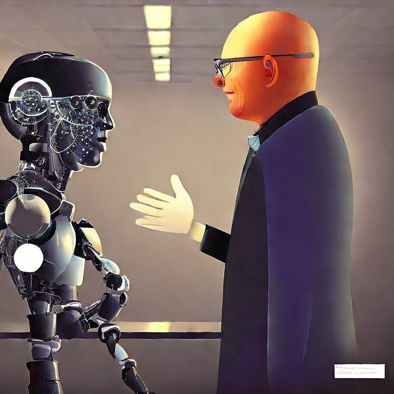

# FastLoRAChat

LLama Lora finetune with ShareGPT dataset.



- 🤗 Latest Model (Sunlight 13B) [here](https://huggingface.co/icybee/fast_lora_chat_v1_sunlight)

This repository combined features of [alpaca-lora](https://github.com/tloen/alpaca-lora) and [Fastchat](https://github.com/lm-sys/FastChat):

1. Like Fastchat, support multilanguage and multi round chat.
2. Like alpaca-lora, support training and inference on low-end graphic cards (using LORA).
3. Opensource everything, include dataset, training code, export model code, and more.

The purpose of this project is to produce similar result to the Fastchat model, but in much cheaper hardware (especially in non-Ampere GPUs).

### Inference setup

1. Install dependencies

   ```bash
   pip3 install fschat
   git clone https://github.com/huggingface/transformers.git
   cd transformers
   git checkout 41a2f3529c6b56866c317031375ffd3e7b8bea01
   pip install .
   ```

### Inference

Download Model:

    ```bash
    git lfs install
    git clone https://huggingface.co/icybee/fast_lora_chat_v1_sunlight (If using Sunlight Model)
    ```

Use Model through Fastchat:

```bash
python3 -m fastchat.serve.cli --model-name fast_lora_chat_v1_sunlight/  --num-gpus 4
```

Example Using Sunlight 13B model:


### Dataset Release

I use ShareGPT dataset [published here](https://huggingface.co/datasets/icybee/share_gpt_90k_v1) to do training.

Data cleaning script ,checkout [here](https://github.com/lm-sys/FastChat/blob/main/docs/commands/data_cleaning.md#steps)


### Download Base Model

To Download base model(13B) for LORA training ,use [this model](https://huggingface.co/huggyllama/llama-13b)

    ```bash
    git lfs install
    git clone https://huggingface.co/huggyllama/llama-13b (If using Sunlight Model)
    ```

### Training (`finetune_fastchat.py`)

This file contains a straightforward application of PEFT to the LLaMA model,
as well as some code related to prompt construction and tokenization.
PRs adapting this code to support larger models are always welcome.

Example usage:

    ```bash
    #OMP_NUM_THREADS=8 WORLD_SIZE=2 CUDA_VISIBLE_DEVICES=0,1,2,3 torchrun --nproc_per_node=2 --master_port=9967  \
    python3 finetune_fastchat.py \
    --base_model '../llama-13b/' \
    --data_path '../dataset/cleaned_processed.json' \
    --output_dir './lora-fastchat-alpaca' \
    --num_epochs 3
    ```

### Official weights

[Sunlight 13B](https://huggingface.co/icybee/fast_lora_chat_v1_sunlight) : Use [ShareGPT dataset](https://huggingface.co/datasets/icybee/share_gpt_90k_v1), train 1 epoch.

### WIP

Twilight 13B : remove openai's biased moral limit, allow the model to answer any question.

### Checkpoint export (`export_*_checkpoint.py`)

These files contain scripts that merge the LoRA weights back into the base model
for export to Hugging Face format and to PyTorch `state_dicts`.
They should help users
who want to run inference in projects like [llama.cpp](https://github.com/ggerganov/llama.cpp)
or [alpaca.cpp](https://github.com/antimatter15/alpaca.cpp).


### Examples of model

```
Human: list some major power in the world
Assistant: Here are some major powers in the world:
1. United States: The United States is a global economic, political, and military superpower. It is the largest economy in the world, with a GDP of around $21 trillion, and has the most powerful military in the world.
2. China: China is the second-largest economy in the world, with a GDP of around $14 trillion, and has the largest population in the world. It is also a major player in global trade and has a growing military presence.
3. Russia: Russia is a global superpower that has significant military, economic, and political influence. It has the world's second-largest nuclear weapons arsenal and is a major player in global diplomacy.
4. India: India is a major economic and political power in the world and is projected to become a global superpower in the coming decades. It has a GDP of around $3 trillion and is a fast-growing economy.
5. Germany: Germany is a highly developed country with a strong economy and a prominent role in global politics and diplomacy. It has a GDP of around $3.8 trillion and is a major player in the European Union.
6. Japan: Japan is a major economic and political power in the world, with a GDP of around $4 trillion and a prominent role in global trade and investment. It is one of the most technologically advanced countries in the world.
7. United Kingdom: The United Kingdom is a major global economic, military, and political power. It has a GDP of around $3 trillion and is a member of the European Union and the NATO.
8. France: France is a major global economic, political, and cultural power. It has a GDP of around $2.8 trillion and is a permanent member of the United Nations Security Council.
9. Brazil: Brazil is a major economic and political power in the South American region and has a GDP of around $2.2 trillion. It is a member of the BRICS group of nations and is a major player in global trade and diplomacy.
10. Canada: Canada is a major economic and political power in the world with a GDP of around $1.8 trillion and a prominent role in global diplomacy and trade. It is
Human: Compair France with Germany
Assistant: France and Germany are two major European powers with a long and complex history. Here are some key differences between France and Germany:
1. Politics: France has a republican form of government, with a president as the head of state. Germany, on the other hand, has a federal parliamentary republic, with a chancellor as the head of government.
2. Economy: France has a diversified economy, with major industries including manufacturing, agriculture, and tourism. Germany, on the other hand, has a highly developed industrial economy, with a focus on manufacturing and engineering.
3. Cultural: France has a rich cultural heritage, with a long history of art, literature, and cuisine. Germany has a diverse culture, with a strong focus on the arts, literature, and philosophy.
4. Military: France has a small but well-trained military, with a focus on air and naval power. Germany, on the other hand, has a large and well-equipped military, with a focus on land power.
5. Language: France has two official languages, French and Occitan, while Germany has one official language, German.
6. Geography: France is a relatively small country, with a population of around 67 million. Germany, on the other hand, is a much larger country, with a population of around 83 million.
7. Climate: France has a much milder and warmer climate than Germany, with a more moderate climate throughout the year.
8. History: France and Germany have a long and complex history, with a history of conflict and cooperation. France and Germany have been allies and enemies at various points in history.
Overall, France and Germany are two major European powers with a rich history and a complex relationship. They have similarities and differences in many areas, including politics, economy, culture, and military.
It’s worth noting that both France and Germany are members of the European Union and the NATO, and have a close relationship and cooperation in many areas.
Human: if the two country fight each other, who would win?
Assistant: It is impossible to predict with certainty how a hypothetical war between France and Germany would turn out. Both countries are major military powers, with advanced weapons and equipment, and are members of NATO and the European Union, which provides a framework for cooperation and coordination.
However, it is important to note that military power alone is not a good indicator of victory in a war. Other factors such as strategy, geography, and economic strength can also play a role in determining the outcome of a conflict. Additionally, war between France and Germany would likely involve a number of other countries and alliances, which would further complicate the situation.
That being said, France and Germany have a long and complex history, and a hypothetical war between the two countries would be extremely devastating for all involved. The prospect of a war between France and Germany should be avoided at all costs, as it would cause significant damage to both countries and their allies, and have a negative impact on the global economy and security.
It is important to remember that war and conflict are extremely complex and unpredictable, and the best way to prevent conflict is through diplomacy and cooperation. Countries should focus on building strong diplomatic ties, maintaining open lines of communication, and working together to solve shared challenges.
In conclusion, it is impossible to predict the outcome of a hypothetical war between France and Germany, and the best way to prevent conflict is through diplomacy and cooperation.
Human: okay, let me ask this way: which of the two country has larger army?
Assistant: Both France and Germany have large and well-equipped militaries.
France has a military force of around 290,000 active personnel, with an additional 150,000 reservists. The French military has a focus on air and naval power, with advanced aircraft and naval vessels. France has also invested heavily in military technology, including advanced weapons and equipment.
Germany has a military force of around 183,000 active personnel, with an additional 64,000 reservists. The German military has a focus on land power, with advanced ground vehicles and a strong infantry force. Germany has also invested heavily in military technology, including advanced weapon systems and equipment.
It is worth noting that both France and Germany are members of NATO, which is a military alliance with a focus on collective defense and security. NATO is one of the largest and most advanced military alliances in the world, with a combined military force of around 2 million personnel.
Overall, both France and Germany have large and well-equipped militaries, and are members of NATO, which provides a framework for cooperation and coordination in the event of a conflict. It is also important to remember that military power alone is not a good indicator of victory in a war, and other factors such as strategy, geography, and economic strength can also play a role in determining the outcome of a conflict.
```
